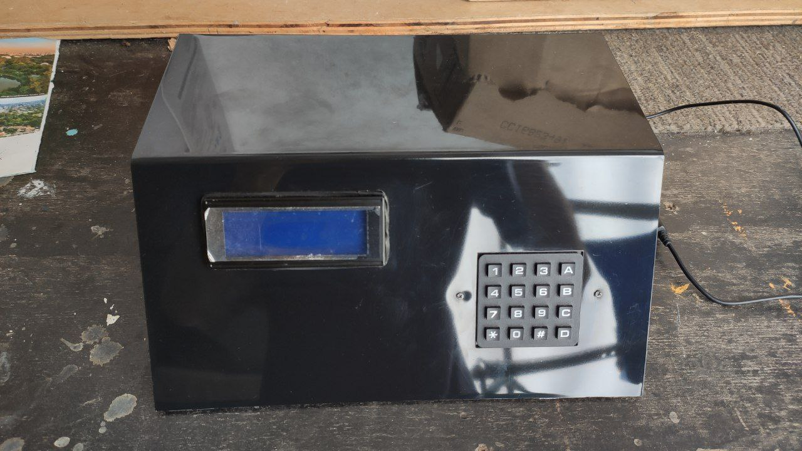

# 🗳️ Urna Eletrônica com Autenticação por RFID – TCC 

Este repositório apresenta o desenvolvimento completo da **Urna Eletrônica com Reconhecimento por Aproximação (RFID)**, projeto realizado como Trabalho de Conclusão de Curso (TCC) do curso Técnico em Eletrônica na **ETEC Getúlio Vargas**.

---

## 🎯 Objetivo

Desenvolver uma urna eletrônica funcional, com autenticação via cartão RFID, oferecendo uma solução didática e acessível para simulação de processos eleitorais, com foco em segurança, confiabilidade e experiência prática de integração entre hardware e software embarcado.

---

## 📦 Estrutura do Repositório

```
📁 codigo/          → Código-fonte completo desenvolvido em MikroC Pro for PIC
📁 diagramas/       → Diagramas elétricos e fluxogramas do projeto
📁 modelo-3d/       → Modelo 3D da estrutura da urna feito no Fusion 360
📁 monografia/      → Documento final do TCC e slides de apresentação
📁 midia/
 ┣ 📁 fotos/        → Imagens do protótipo físico
 ┗ 📁 videos/       → Demonstrações em vídeo do funcionamento
📄 README.md        → Você está aqui 🙂
```


---

## 🧠 Lógica de Funcionamento

1. O eleitor se aproxima da urna com um **cartão RFID**.
2. O sistema, por meio do **PIC18F4620**, autentica o cartão.
3. Após validação, a urna libera o teclado para votação.
4. O eleitor digita o número do candidato.
5. O voto é confirmado, e o sistema se prepara para o próximo eleitor.

---

## 🔧 Tecnologias, Componentes e Softwares Utilizados

### 💻 Softwares
- **MikroC Pro for PIC** – Programação do microcontrolador
- **Proteus** – Simulação eletrônica do sistema
- **Autodesk Fusion 360** – Criação do modelo 3D da urna

### 🔩 Hardware
- Microcontrolador **PIC18F4620**
- Módulo RFID RC522
- Display LCD 16x2
- Teclado matricial 4x4
- LEDs, resistores, buzzer, jumpers, fonte de alimentação

---

## 📷 Demonstrações

### ▶️ Vídeo do Funcionamento
🔗 *[Inserir link para vídeo hospedado no YouTube ou outro serviço]*  
*Ou acesse a pasta `/midia/videos/` para ver os vídeos incluídos.*

### 🖼️ Protótipo Físico



---

## 📄 Documentação

- **Monografia:** [`monografia/TCC_UrnaEletronica.pdf`](monografia/Monografia.pdf)
- **Slides:** [`monografia/Apresentacao_Slides.pptx`](monografia/Slides.pptx)
- **Diagrama Elétrico:** [`diagramas/diagrama_eletrico.pdf`](diagramas/Diagrama_Elétrico.pdf)
- **Fluxogramas:** [`diagramas/fluxogramas.pdf`](diagramas/Fluxograma.pdf)

---

## 👨‍💻 Autores

- **Carlos Santiago Clementino**
- **Ivan Mattheus Batista Lima**

📚 Curso Técnico em Eletrônica  
🏫 **ETEC Getúlio Vargas**  
📆 Conclusão do projeto: 2023

---
